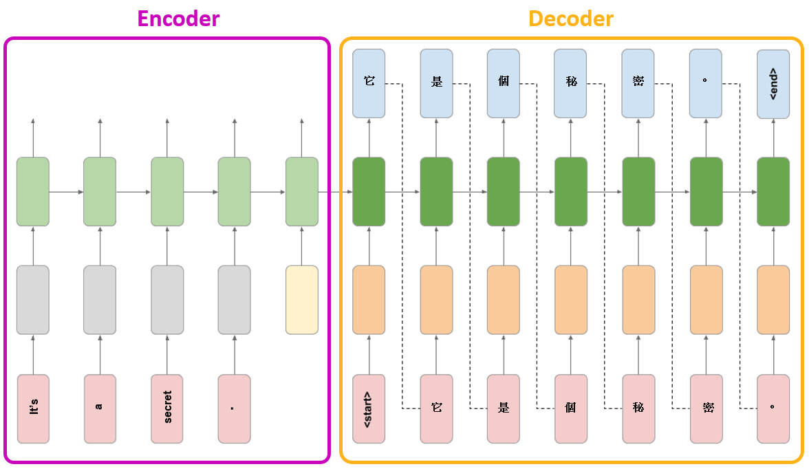
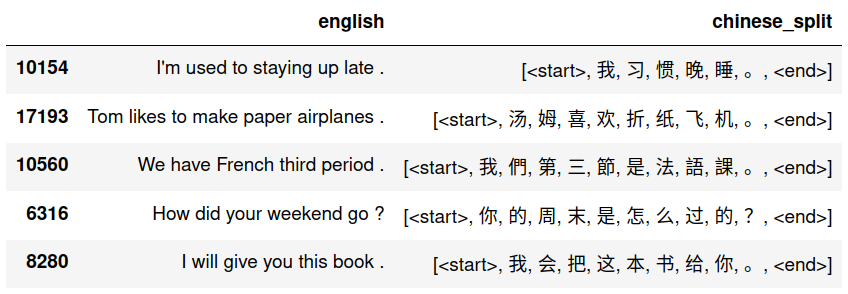
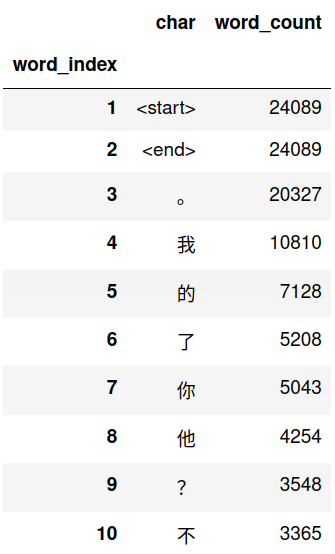
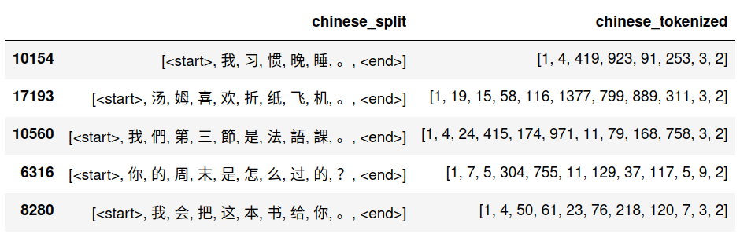
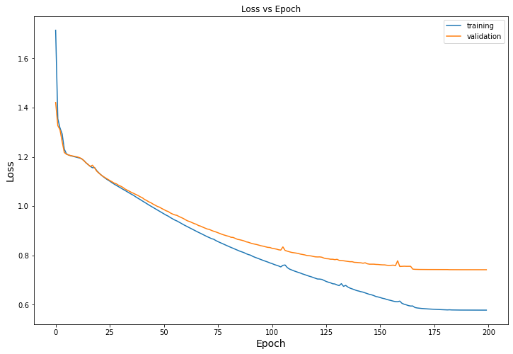

## Neural Translation Model (English-to-Chinese)

---

### Overview

This project is to develop a neural translation model to translate **English** sentences **into Chinese** using recurrent neural networks, namely LSTM (Long Short Term Memory).

The project was adopted from Coursera course *Customising your models with TensorFlow 2*. The original project was to create a English-to-German translation model.

Model layout of the **English-to-Chinese neural translation model** is a follows:

Legend:

Image credit: Image was adopted and modified based on <i>Coursera course - Customising your models with TensorFlow 2</i>'s capstone project image.

---

### Dataset

We are using the **Chinese (Mandarin) - English** language dataset from http://www.manythings.org/anki/.

This dataset consists of over `24,697` pairs of sentences in English and Chinese.

Download the dataset from <a href='http://www.manythings.org/anki/cmn-eng.zip'>this link</a>, and extract the `cmn.txt` raw text file into the path `<repo_root>/data/`.

---

### Data Preprocessing

Notebook: <a href='01-DataPreprocessing.ipynb'>01-DataPreprocessing.ipynb</a>

Raw data from the dataset is preprocessed to split the chinese texts into an array of individual characters, appended with `<start>` and `<end>` tokens.

A sample of 5 preprocessed text sequences is as shown below:

Final preprocessed dataset consists of `24089` pairs of english-to-chinese translation sentenses.

---

### Tokenization

Notebook: <a href='02-Tokenization.ipynb'>02-Tokenization.ipynb</a>

The chinese characters is then tokenized using `tensorflow.keras.preprocessing.text.Tokenizer`.

Word count for top 10 highest frequency characters is as shown below:

There are `3438` unique characters in the chinese sequences, include `<start>`, `<end>` tokens and punctuation marks like `。，？！`.

With the tokenization completed, the individual chinese characters in the sentences are then converted into their respective tokens as shown below:

---

### Model Training

Notebook: <a href='03-ModelTraining.ipynb'>03-ModelTraining.ipynb</a>

**Encoder model**

- The encoder takes words of an English sentence as input, and uses a pre-trained english word embedding (https://tfhub.dev/google/tf2-preview/nnlm-en-dim128-with-normalization/1) to embed the words into a 128-dimensional space. 
- To indicate the end of the input sentence, a special end token (in the same 128-dimensional space) is passed in as an input. This English end token is a trainable variable that is learned in the training phase.

**Decoder model**

- The decoder RNN takes the internal state of the encoder network as its initial state. 
- A `<start>` token is passed in as the first input, which is embedded using a learned Chinese word embedding. 
- The decoder RNN then makes a prediction for the next Chinese word, which during inference is then passed in as the following input, and this process is repeated until the special `<end>` token is emitted from the decoder.

**Training configuration**

The model was trained with a `Nvidia GTX1650Ti` GPU using the following configurations:

|Parameter|Value|
|:-|:-:|
|Optimizer|SGD(learning_rate=0.01,momentum=0.9,nesterov=True)|
|Loss|SparseCategoricalCrossentropy|
|Epoch|150|

**Training result**

The training result is as follows:

|Metric|Value|
|:-|:-:|
|Training time|8hr 14min|
|Lowest training loss|0.572|
|Lowest validation loss|0.565|

The training and validation loss curve is shown below:

---